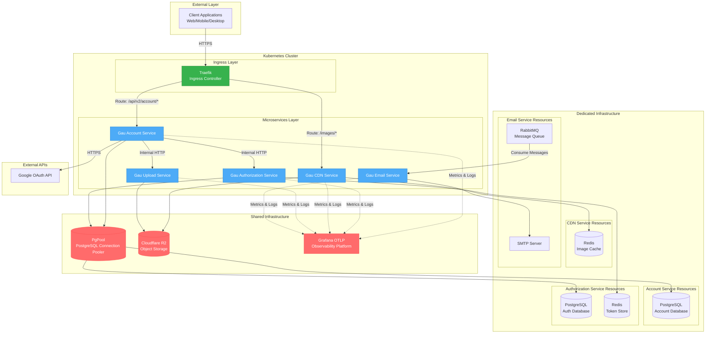

 Gau Backend Services

This repository contains backend services for the "gau" project, organized as a monorepo with multiple Go microservices and supporting scripts.

## Structure

- Each service is located in its own directory (e.g., `gau-account-service/`, `gau-cdn-service/`, etc.)
- Common scripts for initialization and updates are provided (`init.sh`, `update.sh`)
- Each service contains its own source code, configuration, migrations, and deployment scripts (Docker, Kubernetes)

## Services

Below is a list of services and their main functionalities. This table will be updated as new services are added.

| Service Name              | Description / Main Functions                                          | URL                                                     |
|---------------------------|-----------------------------------------------------------------------|---------------------------------------------------------|
| gau-account-service       | User account management (authentication, registration, profile, etc.) | https://github.com/tnqbao/gau-account-service           |
| gau-authorization-service | Authorization, access control, and token management                   | https://github.com/tnqbao/gau-authorization-service.git |
| gau-cdn-service           | CDN and image management                                              | https://github.com/tnqbao/gau-cdn-service               |
| gau-upload-service        | File and media upload management                                      | https://github.com/tnqbao/gau-upload-service            |
| gau-kanban-service        | Kanban board management (boards, columns, tasks, project management)  | https://github.com/tnqbao/gau-kanban-service            |
| gau-email-service         | Email sending and notification management                             | https://github.com/tnqbao/gau-email-service             |
| ...                       | ...                                                                   | (other)                                                 |

## System Architecture

For detailed system architecture diagrams and technical documentation, please refer to [ARCHITECT-DOCUMENT.md](architect-document.md).

### System Overview Diagram

The system overview diagram illustrates the microservices architecture deployed on Kubernetes Cluster. Client requests flow through the Traefik Ingress Controller, which routes them to appropriate microservices. The system utilizes a combination of shared infrastructure (PgPool, Cloudflare R2, Grafana) and dedicated resources for each service (PostgreSQL databases, Redis instances, RabbitMQ). All services send metrics and logs to Grafana for monitoring and observability.

### Architecture Overview

The Gau Backend Microservices system is built on a modern microservices architecture deployed on Kubernetes. The system consists of five core services, each with specific responsibilities, and uses a combination of shared and dedicated infrastructure resources.

#### Key Components

- **Ingress Layer**: Traefik Ingress Controller handles all incoming traffic and routes requests to appropriate services
- **Microservices Layer**: Five independent services (Account, Authorization, CDN, Upload, Email) that can be deployed and scaled independently
- **Shared Infrastructure**: PgPool (PostgreSQL connection pooler), Cloudflare R2 (object storage), and Grafana OTLP (observability)
- **Dedicated Infrastructure**: Each service has its own dedicated resources (PostgreSQL databases, Redis instances, RabbitMQ queue)

#### Service Communication

- **Synchronous**: HTTP/HTTPS for inter-service communication
- **Asynchronous**: RabbitMQ message queue for email processing
- **Caching**: Redis to reduce latency and backend system load

#### Infrastructure Resources

| Service                   | PostgreSQL           | Redis     | RabbitMQ           | Cloudflare R2 | SMTP         | External APIs | Grafana OTLP |
|---------------------------|----------------------|-----------|--------------------|---------------|--------------|---------------|--------------|
| Gau Account Service       | Dedicated via PgPool | N/A       | N/A                | N/A           | N/A          | Google OAuth  | Shared       |
| Gau Authorization Service | Dedicated via PgPool | Dedicated | N/A                | N/A           | N/A          | N/A           | Shared       |
| Gau CDN Service           | N/A                  | Dedicated | N/A                | Shared        | N/A          | N/A           | Shared       |
| Gau Upload Service        | N/A                  | N/A       | N/A                | Shared        | N/A          | N/A           | Shared       |
| Gau Email Service         | N/A                  | N/A       | Dedicated Consumer | N/A           | Gmail/Custom | N/A           | Shared       |

#### Service Dependencies

| Service                   | Calls Services                                | Called By Services                      |
|---------------------------|-----------------------------------------------|-----------------------------------------|
| Gau Account Service       | Gau Authorization Service, Gau Upload Service | N/A (Entry Point)                       |
| Gau Authorization Service | N/A                                           | Gau Account Service, Gau Kanban Service |
| Gau CDN Service           | N/A                                           | N/A (Public Endpoint)                   |
| Gau Upload Service        | N/A                                           | Gau Account Service                     |
| Gau Email Service         | N/A                                           | N/A (Consumer Only)                     |

### Deployment Information

#### Kubernetes Configuration
- **Orchestration**: Kubernetes
- **Ingress Controller**: Traefik
- **Routing Strategy**: Path-based routing with annotations
- **Deployment Strategy**: Rolling update
- **Auto Scaling**: Horizontal Pod Autoscaler (HPA) configured

#### Security
- **Internal Communication**: Private Key validation between services
- **External Access**: JWT token authentication
- **Secret Management**: Kubernetes Secrets and ConfigMaps
- **TLS/SSL**: Handled at Traefik ingress layer

#### Observability
- **Logging**: Centralized logging with Grafana OTLP
- **Metrics**: OpenTelemetry metrics sent to Grafana
- **Tracing**: Distributed tracing support
- **Service Name**: Each service has its own service name in Grafana

#### Scalability
- **Stateless Services**: All services are stateless and can scale horizontally
- **Connection Pooling**: PgPool manages PostgreSQL connections efficiently
- **Caching Layer**: Redis reduces load on database and object storage
- **Message Queue**: RabbitMQ allows asynchronous task processing
- **Object Storage**: Cloudflare R2 with Redis cache for serving static content

### Design Principles
- **Microservices Architecture**: Each service has distinct responsibilities
- **Service Independence**: Services can be deployed and scaled independently
- **Data Isolation**: Each service manages its own data
- **API Gateway Pattern**: Traefik serves as the single entry point
- **CQRS**: Separation of read and write operations in some services

## Getting Started

### Prerequisites
