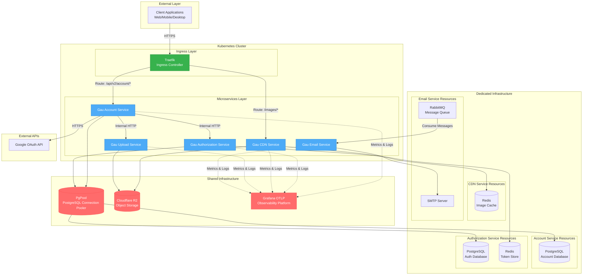
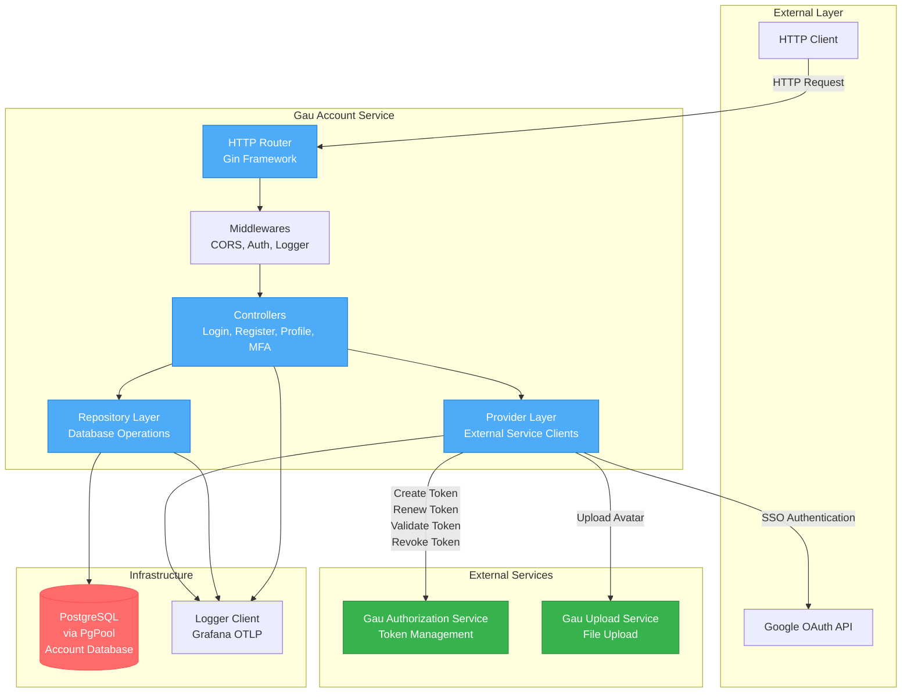
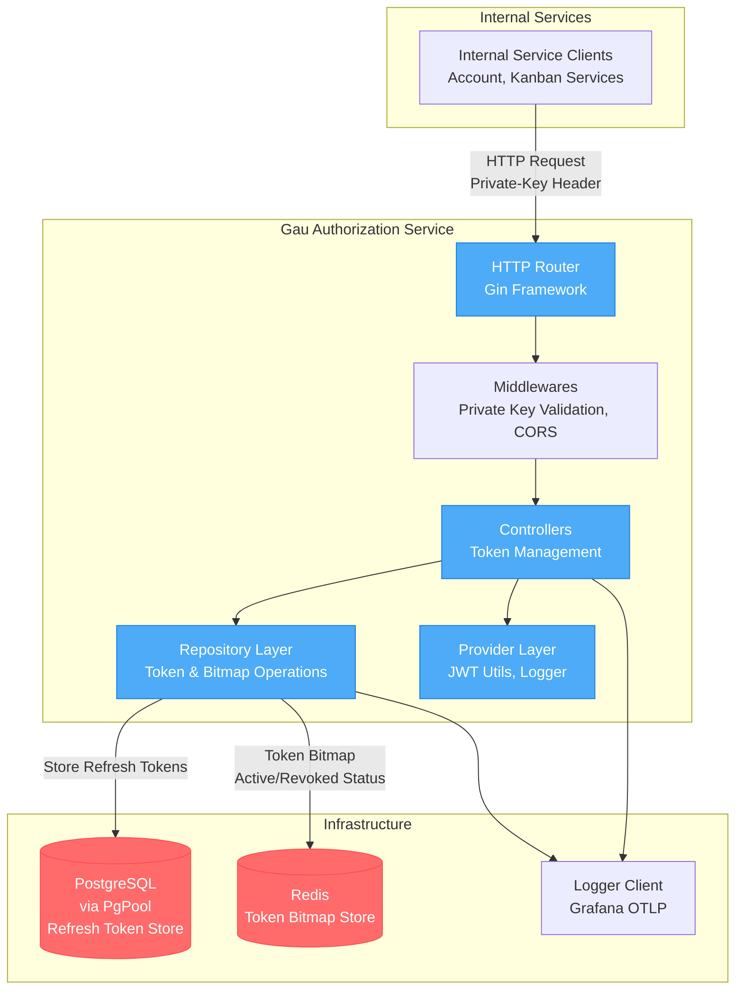
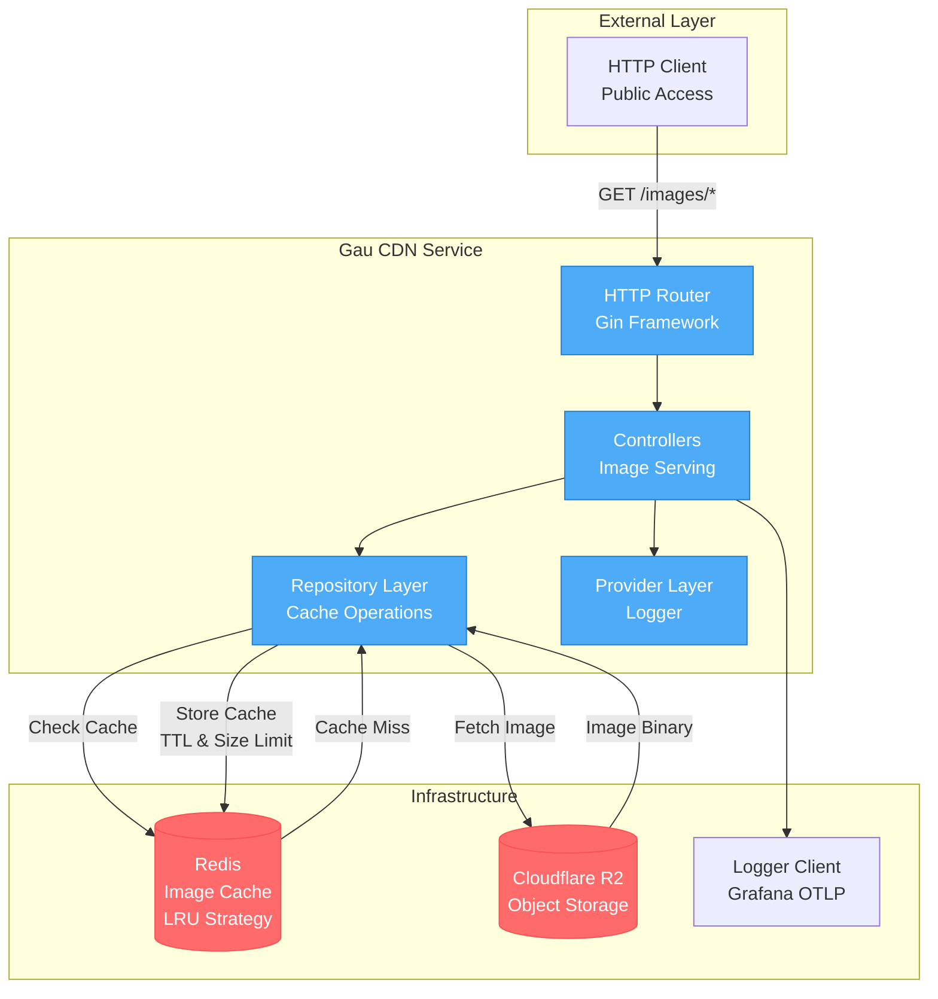
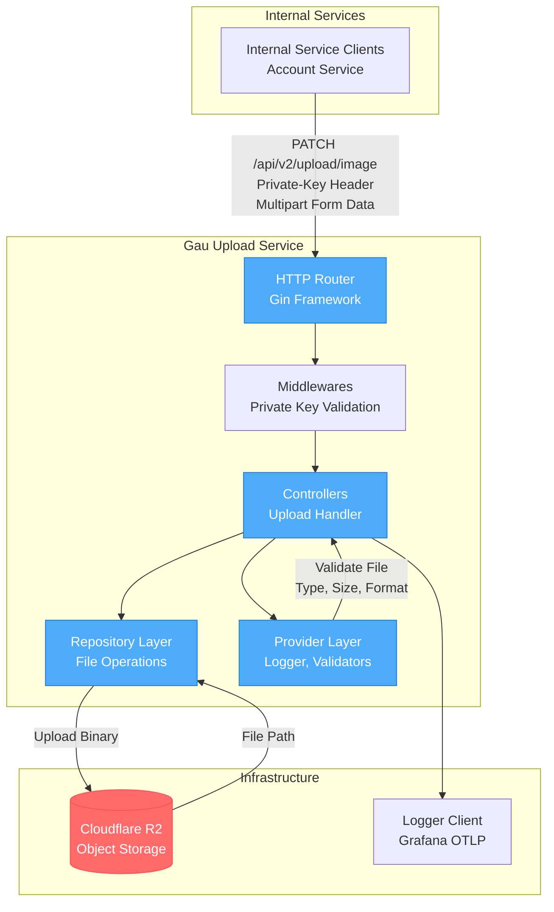
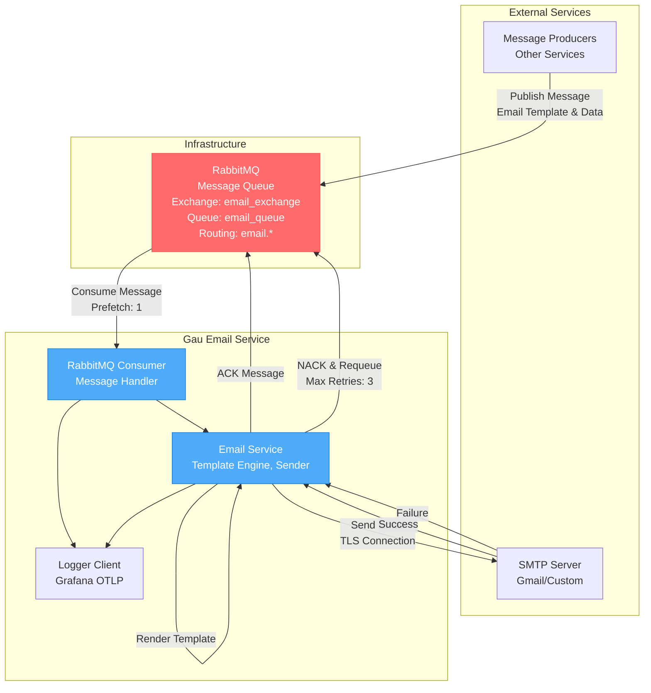

# Gau Backend Microservices System Architecture

## System Overview Diagram

The system overview diagram illustrates the microservices architecture deployed on Kubernetes Cluster. Client requests flow through the Traefik Ingress Controller, which routes them to appropriate microservices. The system utilizes a combination of shared infrastructure (PgPool, Cloudflare R2, Grafana) and dedicated resources for each service (PostgreSQL databases, Redis instances, RabbitMQ). All services send metrics and logs to Grafana for monitoring.

---

## Gau Account Service

Gau Account Service manages user accounts, handling registration, login, profile management, and MFA. The service connects to a dedicated PostgreSQL database via PgPool to store user information. It integrates with Gau Authorization Service for token management, Gau Upload Service for avatar uploads, and Google OAuth API for SSO functionality. All operations are logged to Grafana.

---

## Gau Authorization Service

Gau Authorization Service is responsible for token management and authorization in the system. The service uses Private Key authentication to validate requests from internal services. It connects to a dedicated PostgreSQL database to store refresh tokens and a dedicated Redis instance to manage token bitmaps, enabling fast token revocation. All token operations are logged to Grafana.

---

## Gau CDN Service

Gau CDN Service provides static image serving from Cloudflare R2 storage. The service uses Redis as a cache layer with LRU strategy to reduce access frequency to object storage. On request, the service checks the cache first, and only fetches from Cloudflare R2 on cache miss, then stores in cache. The service is completely stateless and can scale horizontally.

---

## Gau Upload Service

Gau Upload Service handles file uploads to Cloudflare R2 object storage. The service only accepts requests from internal services through Private Key validation. It validates file type, size, and format before uploading, ensuring only valid files within configured size limits are accepted. The service returns the file path upon successful upload.

---

## Gau Email Service

Gau Email Service operates as a consumer, listening to messages from the RabbitMQ queue. The service receives email templates and data, renders templates, and sends emails via SMTP server. It implements a retry mechanism with a maximum of 3 retries per message. On success, messages are ACKed; on failure, messages are NACKed and requeued for retry. The service is completely asynchronous and does not block other operations.

---

## Resource Summary

### Resource Allocation By Service

| Service | PostgreSQL | Redis | RabbitMQ | Cloudflare R2 | SMTP | External APIs | Grafana OTLP |
|---------|-----------|-------|----------|---------------|------|---------------|--------------|
| Gau Account Service | Dedicated via PgPool | N/A | N/A | N/A | N/A | Google OAuth | Shared |
| Gau Authorization Service | Dedicated via PgPool | Dedicated | N/A | N/A | N/A | N/A | Shared |
| Gau CDN Service | N/A | Dedicated | N/A | Shared | N/A | N/A | Shared |
| Gau Upload Service | N/A | N/A | N/A | Shared | N/A | N/A | Shared |
| Gau Email Service | N/A | N/A | Dedicated Consumer | N/A | Gmail/Custom | N/A | Shared |

### Service Dependencies

| Service | Calls Services | Called By Services |
|---------|----------------|-------------------|
| Gau Account Service | Gau Authorization Service, Gau Upload Service | N/A (Entry Point) |
| Gau Authorization Service | N/A | Gau Account Service, Gau Kanban Service |
| Gau CDN Service | N/A | N/A (Public Endpoint) |
| Gau Upload Service | N/A | Gau Account Service |
| Gau Email Service | N/A | N/A (Consumer Only) |

---

## Deployment Information

### Kubernetes Configuration
- **Orchestration**: Kubernetes
- **Ingress Controller**: Traefik
- **Routing Strategy**: Path-based routing with annotations
- **Deployment Strategy**: Rolling update
- **Auto Scaling**: Horizontal Pod Autoscaler (HPA) configured

### Security
- **Internal Communication**: Private Key validation between services
- **External Access**: JWT token authentication
- **Secret Management**: Kubernetes Secrets and ConfigMaps
- **TLS/SSL**: Handled at Traefik ingress layer

### Observability
- **Logging**: Centralized logging with Grafana OTLP
- **Metrics**: OpenTelemetry metrics sent to Grafana
- **Tracing**: Distributed tracing support
- **Service Name**: Each service has its own service name in Grafana

### Scalability
- **Stateless Services**: All services are stateless and can scale horizontally
- **Connection Pooling**: PgPool manages PostgreSQL connections efficiently
- **Caching Layer**: Redis reduces load on database and object storage
- **Message Queue**: RabbitMQ allows asynchronous task processing
- **Object Storage**: Cloudflare R2 with Redis cache for serving static content

---

## Architecture Notes

### Shared Resources
- **PgPool**: PostgreSQL connection pooler for efficient connection management
- **Cloudflare R2**: Object storage for images and files, cached by Redis
- **Grafana OTLP**: Observability platform for all services

### Dedicated Resources
- **PostgreSQL Databases**: Each service has its own database to ensure data isolation
- **Redis Instances**: Authorization service uses it for token bitmap, CDN service for image cache
- **RabbitMQ Queue**: Dedicated for Email service consumer

### Communication Patterns
- **Synchronous**: HTTP/HTTPS for inter-service communication
- **Asynchronous**: RabbitMQ message queue for email processing
- **Caching**: Redis to reduce latency and backend system load

### Design Principles
- **Microservices Architecture**: Each service has distinct responsibilities
- **Service Independence**: Services can be deployed and scaled independently
- **Data Isolation**: Each service manages its own data
- **API Gateway Pattern**: Traefik serves as the single entry point
- **CQRS**: Separation of read and write operations in some services
