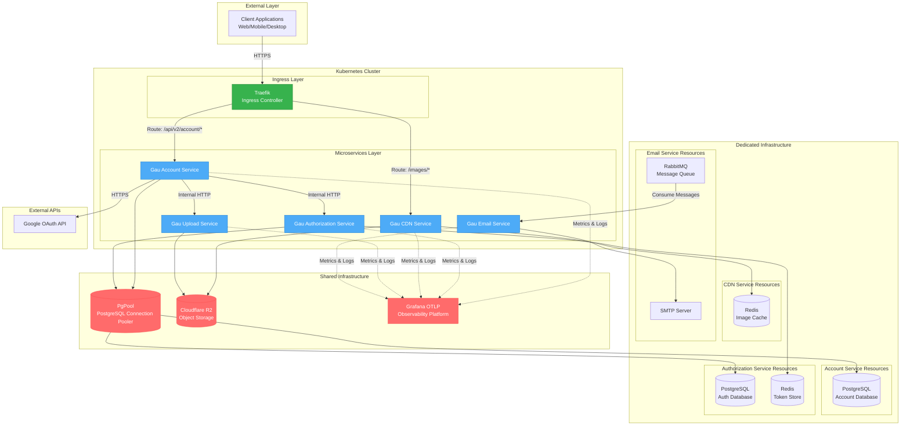
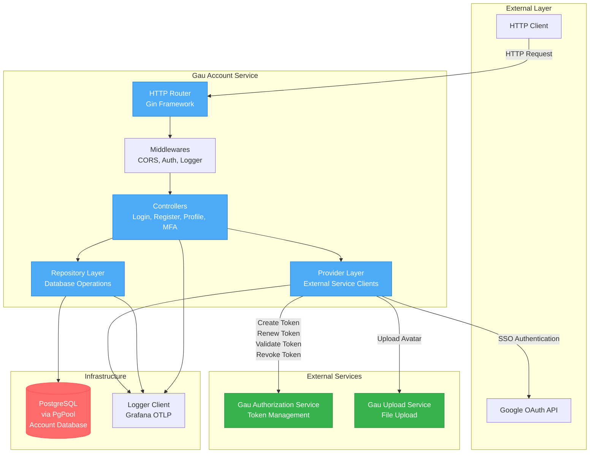
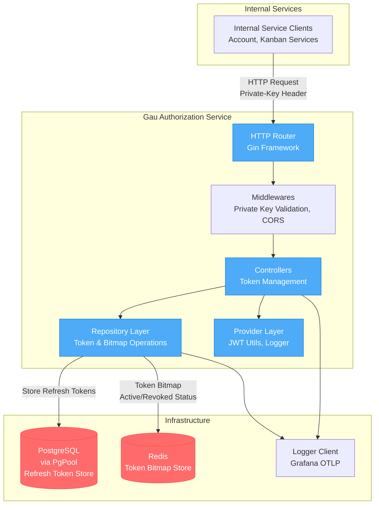
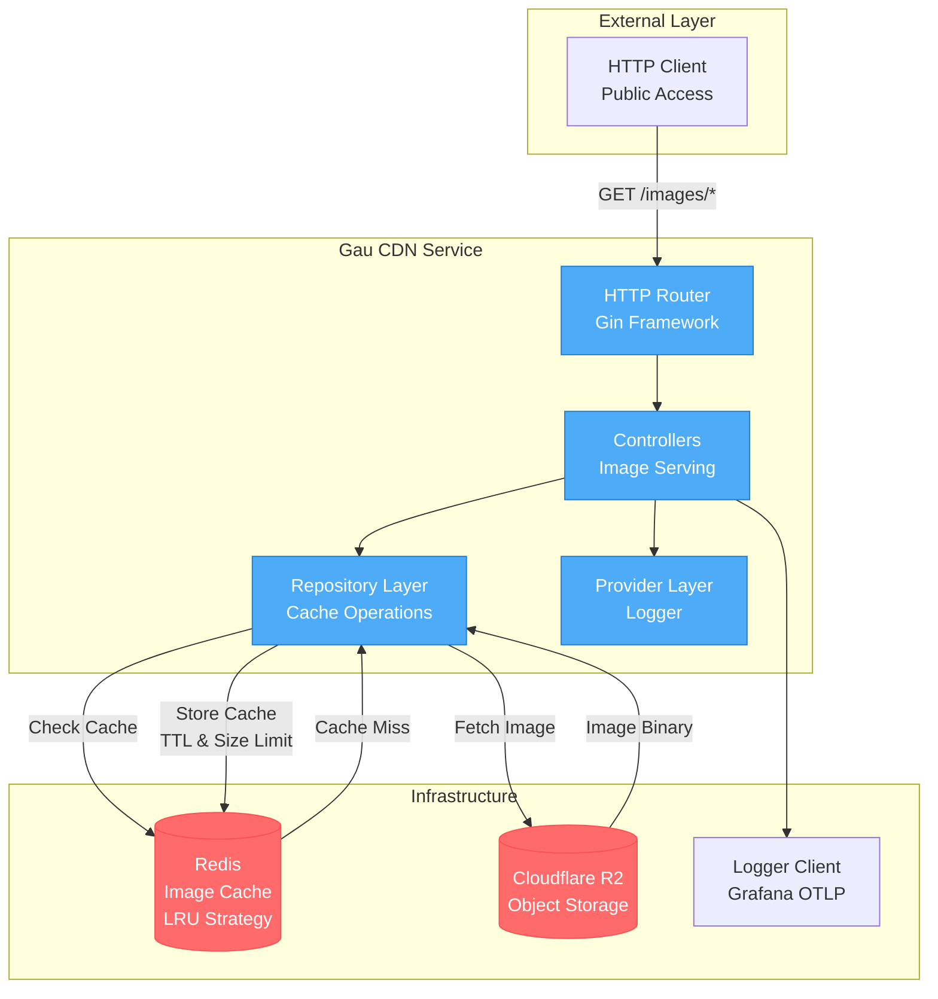
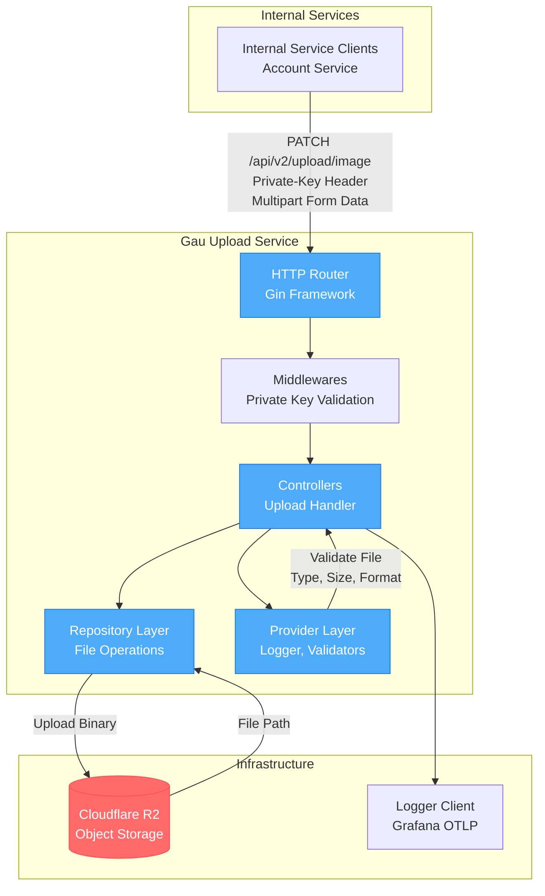
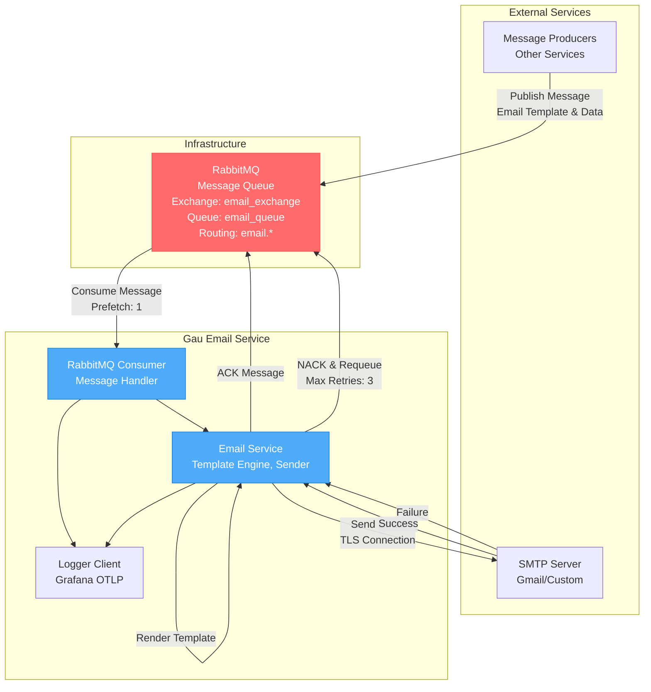

# Kiến Trúc Hệ Thống Gau Backend Microservices

## Sơ Đồ Tổng Quan Hệ Thống

Sơ đồ tổng quan mô tả kiến trúc microservices được triển khai trên Kubernetes Cluster. Client gửi request qua Traefik Ingress Controller, được định tuyến đến các microservices tương ứng. Hệ thống sử dụng kết hợp tài nguyên dùng chung (PgPool, Cloudflare R2, Grafana) và tài nguyên riêng cho từng service (PostgreSQL databases, Redis instances, RabbitMQ). Tất cả services đều gửi metrics và logs về Grafana để monitoring.

---

## Gau Account Service

Gau Account Service quản lý tài khoản người dùng, xử lý đăng ký, đăng nhập, quản lý profile và MFA. Service kết nối với PostgreSQL database riêng qua PgPool để lưu trữ thông tin người dùng. Service tích hợp với Gau Authorization Service để quản lý token, Gau Upload Service để xử lý upload avatar, và Google OAuth API cho chức năng SSO. Tất cả hoạt động được ghi log về Grafana.

---

## Gau Authorization Service

Gau Authorization Service chịu trách nhiệm quản lý token và phân quyền trong hệ thống. Service sử dụng Private Key để xác thực request từ các internal services. Service kết nối với PostgreSQL database riêng để lưu trữ refresh tokens và Redis riêng để quản lý token bitmap, cho phép revoke tokens nhanh chóng. Tất cả token operations đều được log về Grafana.

---

## Gau CDN Service

Gau CDN Service cung cấp chức năng serve static images từ Cloudflare R2 storage. Service sử dụng Redis làm cache layer với LRU strategy để giảm số lần truy cập vào object storage. Khi có request, service kiểm tra cache trước, nếu cache miss mới fetch từ Cloudflare R2 và lưu vào cache. Service hoàn toàn stateless và có thể scale horizontal.

---

## Gau Upload Service

Gau Upload Service xử lý upload file lên Cloudflare R2 object storage. Service chỉ nhận request từ các internal services thông qua Private Key validation. Service validate file type, size và format trước khi upload, đảm bảo chỉ accept các file hợp lệ với size limit được cấu hình. Service trả về file path sau khi upload thành công.

---

## Gau Email Service

Gau Email Service hoạt động như một consumer, lắng nghe messages từ RabbitMQ queue. Service nhận email templates và data, render template và gửi email qua SMTP server. Service implement retry mechanism với maximum 3 retries cho mỗi message. Nếu gửi thành công, message được ACK, nếu thất bại message sẽ được NACK và requeue để retry. Service hoàn toàn asynchronous, không block các operations khác.

---

## Tổng Hợp Tài Nguyên

### Bảng Tài Nguyên Theo Service

| Service | PostgreSQL | Redis | RabbitMQ | Cloudflare R2 | SMTP | External APIs | Grafana OTLP |
|---------|-----------|-------|----------|---------------|------|---------------|--------------|
| Gau Account Service | Dedicated via PgPool | N/A | N/A | N/A | N/A | Google OAuth | Shared |
| Gau Authorization Service | Dedicated via PgPool | Dedicated | N/A | N/A | N/A | N/A | Shared |
| Gau CDN Service | N/A | Dedicated | N/A | Shared | N/A | N/A | Shared |
| Gau Upload Service | N/A | N/A | N/A | Shared | N/A | N/A | Shared |
| Gau Email Service | N/A | N/A | Dedicated Consumer | N/A | Gmail/Custom | N/A | Shared |

### Bảng Kết Nối Giữa Các Services

| Service | Gọi Đến Services | Được Gọi Bởi Services |
|---------|-----------------|---------------------|
| Gau Account Service | Gau Authorization Service, Gau Upload Service | N/A (Entry Point) |
| Gau Authorization Service | N/A | Gau Account Service, Gau Kanban Service |
| Gau CDN Service | N/A | N/A (Public Endpoint) |
| Gau Upload Service | N/A | Gau Account Service |
| Gau Email Service | N/A | N/A (Consumer Only) |

---

## Thông Tin Triển Khai

### Kubernetes Configuration
- **Orchestration**: Kubernetes
- **Ingress Controller**: Traefik
- **Routing Strategy**: Path-based routing với annotations
- **Deployment Strategy**: Rolling update
- **Auto Scaling**: Horizontal Pod Autoscaler (HPA) được cấu hình

### Security
- **Internal Communication**: Private Key validation giữa các services
- **External Access**: JWT token authentication
- **Secret Management**: Kubernetes Secrets và ConfigMaps
- **TLS/SSL**: Được xử lý tại Traefik ingress layer

### Observability
- **Logging**: Centralized logging với Grafana OTLP
- **Metrics**: OpenTelemetry metrics được gửi về Grafana
- **Tracing**: Distributed tracing support
- **Service Name**: Mỗi service có service name riêng trong Grafana

### Scalability
- **Stateless Services**: Tất cả services đều stateless, có thể scale horizontal
- **Connection Pooling**: PgPool quản lý PostgreSQL connections hiệu quả
- **Caching Layer**: Redis giảm tải cho database và object storage
- **Message Queue**: RabbitMQ cho phép xử lý asynchronous tasks
- **Object Storage**: Cloudflare R2 với Redis cache để serve static content

---

## Ghi Chú Kiến Trúc

### Tài Nguyên Dùng Chung
- **PgPool**: PostgreSQL connection pooler, giúp quản lý connections hiệu quả
- **Cloudflare R2**: Object storage cho images và files, được cache bởi Redis
- **Grafana OTLP**: Observability platform cho tất cả services

### Tài Nguyên Riêng
- **PostgreSQL Databases**: Mỗi service có database riêng để đảm bảo data isolation
- **Redis Instances**: Authorization service dùng cho token bitmap, CDN service dùng cho image cache
- **RabbitMQ Queue**: Dedicated cho Email service consumer

### Communication Patterns
- **Synchronous**: HTTP/HTTPS cho inter-service communication
- **Asynchronous**: RabbitMQ message queue cho email processing
- **Caching**: Redis để giảm latency và tải cho backend systems

### Design Principles
- **Microservices Architecture**: Mỗi service có responsibility riêng biệt
- **Service Independence**: Services có thể deploy và scale độc lập
- **Data Isolation**: Mỗi service quản lý data riêng
- **API Gateway Pattern**: Traefik làm single entry point
- **CQRS**: Separation of read và write operations ở một số services
